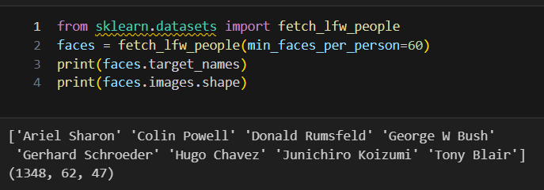
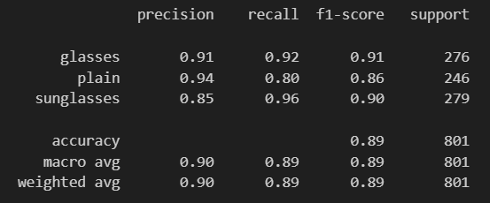

# ChangeLog

## Changes
### Notebook
If you wish to experiment with the code, you can find the notebook in the reposititory at the link below. There is no collab notebook due to the size of the dataset exceeding GitHub's size limit.<br> 
[Notebook - Glasses Image Classification](https://github.com/SHAKyMLRepo/Project-5-Glasses-Detection-using-Support-Vector-Machines/blob/main/SVM_Project.ipynb)
<br>
### Project Goals
<p> The goal of the notebook being followed is to give an overview of the Support Vector Machine machine learning algorithm. For credit to the author and reference a link to the notebook being followed can be found at the following link: https://jakevdp.github.io/PythonDataScienceHandbook/05.07-support-vector-machines.html <br>
One task this notebook completes which inspired the current project is the classification of a number of images of famous people into the correct person labelled in the training data.</p>
<br>



<br>
<g> The goal of this project has been changed to another image classification task. The classes to be identified from a number of images of people are those not wearing glasses, those wearing glasses or those wearing sunglasses. This project will attempt to use Support Vector Machine machine learning techniques to make these classifications based on the input images.

### Data Source
<p> The source notebook retrieves the data it uses for its predictions from included datasets within the sklearn platform. This project instead sources its data from kaggle using twos datasets. These wwo datasets are used to boost the amount of data available to try and increase prediction acccuracy. The two datasets used are as follows:

1. **Glasses and Covering**
    - **Description**: This dataset was designed for the training of facial recognition. This contains a total of 2537 images of faces where the images are aligned and cropped around the face. This dataset contains 5 classes, plain (no glasses), glasses (with glasses), sunglasses (with sunglasses), sunglasses-imagenet (additional sunglasses) and coverings( faces with various coverings eg. masks). The image class is defined by the directory it is in within the dataset.
    - **Usage**: As this project is attempting to find only 3 of the classes contained in the dataset, only plain, glasses, sunglasses and sunglasses-imagenet will be used.
    - **Source Quality**: This dataset was sourced from Kaggle and has a high usability score from Kaggle users.
    - **Link**: [here](https://www.kaggle.com/datasets/mantasu/glasses-and-coverings)

2. **People with and without glasses dataset**
     - **Description** This dataset contains 4920 color images split into two folders glaases and  and without_mask to denote their class. These classes are images where a face is not wearing glasses and is wearing glasses.
     - **Source Quality**: The data was sourced from Kaggle and has a low usability score. This means that it will have to be checked in preprocessing to ensure it's data quality.
     - **Link**: [here](https://www.kaggle.com/datasets/saramhai/people-with-and-without-glasses-dataset)

### Data Exploration
<p> As this project is using a different dataset, some data exploration and preprocessing is required to make sure the data is clean and ready for modelling. The reference notebook uses native sklearn functions to perform data exploration on it's image set as seen below. </p>

<p> In this project, custom data exploration is involved. First a function was created to gather metadata on the contents of each dataset seperately as below. This function counted the size of each class in terms of images, validated that each file had a picture suffix such as .jpg and counted any files that did not have the correct format.</p>

```
from collections import defaultdict

#Create function to explore datasets
def getfolderinfo(FOLDER_PATH,folders):
    # Define a default dict to store folder properties
    folder_info = defaultdict(dict)
    for folder in folders:
        path = os.path.join(FOLDER_PATH, folder)
        length = len(os.listdir(path))
        folder_info[folder]['length'] = length
        suffix_count = defaultdict(int)
        not_image = 0
        # Check files in folder
        for img in os.listdir(path):
            # Check suffix
            suffix = img.split('.')[-1]
            # Define these suffix as valid image files
            if suffix.lower() in ['jpg', 'jpeg', 'png', 'gif']:
                suffix_count[suffix] += 1
            else:
                not_image += 1

            # Save folder info            
            folder_info[folder]['suffix_frequency'] = suffix_count
            folder_info[folder]['not_image'] = not_image

    return folder_info
```
#### Dataset - Glasses and Covering


<p> The above function was used to analyse the contents of this dataset. The results showed that the dataset is balanced in terms of numbers of images so there is not imbalance in the data which might cause bias.</p>


<p><p> All files in folders are images with most files being jpg in this dataset with small exception. This should cause no problems going forward.</p>

#### Dataset - Glasses and no glasses

<p>Here the data analysis on this dataset showed that it is fairly balanced with a slight bias towards images with glasses with a difference of about 16%. This may cause a slight bias but these datasets will be combined so the variance must be rechecked then.</p>


<p> All files in folders are images with all files being jpg in this dataset. This should cause no problems going forward.</p>


#### Dataset - Combined
<p>Combining these datasets leads to a large imbalance in numbers of images of either glasses or no glasses against those with sunglasses. This has the potential to bias the model against the sunglasses class. To rectify, when creating training data, one possible solution is to take all images from sunglasses and an equal number of images from glasses and plain but the project will use model evaluation to see how this imbalance effects model performance.</p>


<p>Above some sample images from the dataset</p>

### Data Preprocessing

#### Parsing Images
<p>Since the reference notebook got its data from sklearn it was already in the correct format for input into the machine learning algorithm. Our datasets however had to be prepared and reshaped before processing. To do this processing, I created a function to iterate through the folders and read the images into tuples of the image array and its corresponding label.</p>

```
##Reading all the images and converting to array for data and labels

def create_training_data(FOLDER, folders):
    training_data = []
    for folder in folders:
        path = os.path.join(FOLDER, folder)
        class_num = folders.index(folder) #0,1
        for img in os.listdir(path)[:len(os.listdir(path))]:
            try:
                img_array = cv2.imread(os.path.join(path + "\\" + img), cv2.IMREAD_GRAYSCALE)
                backtorgb = cv2.cvtColor(img_array, cv2.COLOR_GRAY2RGB)
                new_array = cv2.resize(backtorgb, (256, 256))
                training_data.append([new_array, class_num])
            except Exception as e:
                pass 
    return training_data

```
#### Flattening Images
<p> The image arrays then had to be translated into numpy arrays and flattened for use with the Support Vector Machine algorithm.</p>

```
# Flatten images
X_train = X_train.reshape(X_train.shape[0],-1)
X_train.shape
```

### Model Creation

#### Models
<p> For this project a number of models using different data and hyperparameters were created to try and finetune the model to achieve the highest accuracy possible.</p>

##### Model 1
<p> The first model was a Support Vector Machine with kernel set to rbf and class_weight set to balanced. These are two of the parameters which can be used to tune the model.

```
model = SVC(kernel='rbf', class_weight='balanced')
```

- **Kernel**: The default kernel is RBF standing for Radial Balance Function and is effective for non-linear relationships in data.<br>
- **Class_weight**: This is a weight applied to the target classes. Can be used to balance imbalanced class distributions. eg. sunglasses.

###### Model 1 Evaluation
**Result**: Dataset was too large for SVM. SVMs have poor performance on large datasets due to the exponentially increasing calculations required as the dataset grows. Therefore this model had to be discarded.

##### Model 2
<p> For the next model, this project used Principal Component Analysis to see if this could reduce the data the SVM must calculate a fit for. This model created a fit in around 120 seconds compared to the previous which ran for 20 minutes before stopping execution. This shows that using PCA is a useful tool when utilizing the standard SVM algorithm on large datasets. </p>

```
from sklearn.pipeline import make_pipeline

#Set components to 150
pca = PCA(n_components=150, whiten=True,
          svd_solver='randomized', random_state=42)
svc = SVC(kernel='rbf', class_weight='balanced')
model = make_pipeline(pca, svc)
```

###### Model 2 Evaluation


**Result**: The results for model 2 performance shows that this model works well for glasses and no glasses but poorly for the sunglasses class. The imbalance in the dataset does indeed seem to cause bias in our model around the sunglasses class.

##### Model 3
<p> For this model, class_weight will be used to try and improve accuracy for the sunglasses class by calculating weights for each class. The code below was used to estimate appropriate class weighting based on their frequency.</p>

```
class_weights=[]
for i, size in enumerate(combined_size):
    class_weights.append( str(combined_sum / (entries * size)))
class_weights
```
<p>The model code can be viewed below. The class_weights parameter takes a dict with keys being the classes and values being strings containing the weighting value.</p>

```
pca = PCA(n_components=150, whiten=True,
          svd_solver='randomized', random_state=42)
svc = SVC(kernel='rbf', class_weight=class_weights_dict)
model = make_pipeline(pca, svc)
```

###### Model 3 Evaluation


**Result**: The results for model 3 were surprising as adding these weighting values did not change model performance.

##### Model 4
<p> For this model, since class_weight did not seem to work, the next step was to change the training data itself. As such the create_training_data function was adapted to produce training data with an equal distribution of images for each class. The code can be seen below.</p>

```
def create_training_data_equalised(FOLDER, folders):
    training_data = []
    
    # Get max number of files
    files_folder = [[len(os.listdir(os.path.join(FOLDER, folder))),folder] for folder in folders]
    max_files_path = os.path.join(FOLDER, min(files_folder)[1])
    max_files_count = min(files_folder)[0]
    
    # Transfer max number of files
    for folder in folders:
        for i in range(0,max_files_count-1):
            try:
                path = os.path.join(FOLDER, folder)
                img = os.listdir(path)[i]
                img_array = cv2.imread(os.path.join(path, img), cv2.IMREAD_GRAYSCALE)
                backtorgb = cv2.cvtColor(img_array, cv2.COLOR_GRAY2RGB)
                new_array = cv2.resize(backtorgb, (256, 256))
                class_num = folders.index(folder)
                training_data.append([new_array, class_num])
            except Exception as e:
                pass
    return training_data

```
<p>The model itself used the same setup as Model 2 so only the training data was altered.</p>

###### Model 4 Evaluation



**Result**: The results for model 4 were very promising. A small decrease in accuracy for plain and sunglasses was observed but a large decrease in bias was also achieved for the sunglasses class. This suggest that the poor results for sunglasses were indeed related to the imbalanced dataset.

##### Model 5
<p>For model 5, the focus will be on tuning the hyperparameters for the Support Vector Machine.There are two parameters that first will be considered:</p>

- **C**: This parameter controls margin hardness (the tradeoff between maximum margin and minimum classification error).
- **Gamma**: This parameter sets the distance from the margin in which the algorithm will consider point for margin calculations. Small gamma means the algorithm will consider points at larger distances.

<p>GridSearchCV was use to perform cross validation to find the optimal parameters for these two hyperparameters</p>

```
from sklearn.model_selection import GridSearchCV
param_grid = {'svc__C': [1, 5, 10, 50],
              'svc__gamma': [0.0001, 0.0005, 0.001, 0.005]}
grid = GridSearchCV(model, param_grid)

%time grid.fit(X1_train, y1_train)
```
<p>This cross validation needed 9 hours of CPU time to compute once again showing the challenges of working with Support Vector Machines with large datasets and found the parameters below as the best parameters.</p>


###### Model 5 Evaluation


**Result**: The results for model 5 were the best so far with a good balance of accuracy for all classes. This shows that the cross validation did find better parameters for model accuracy</p>

##### Model 6
<p>For model 6, further tuning of the sample number n_components for the PCA decomposition and C parameter for the SVM. This was done manually due to the excessivecomputation time needed for cross validation on this large dataset. The best values for these parameters found was n_components:75 and C parameter 7.5, between the 5 and 10 possible values the cross validation checked.</p>

###### Model 5 Evaluation


**Result**: Model 6 was the most accurate model found with a good balance between the accuracy for all classes.

### Learning Outcomes
The completion of this project illustrated a number learning points for machine learning tasks and Support Vector Machines in particular:
1. **The Challenges of SVM on Large Datasets**: This project highlighed the limitations of SVM when dealing with large datasets. The size of the dataset in this project limited how Support Vector Machines could be used as the time taken to complete the calculations was too large. However, the project also showed how a technique like Principal Component Analysis could be used to reduce the size of the data by picking key features and allow a SVM model to avoid these limitations.

2. **Risk of Bias due to imbalanced data**: The completion of this project showed the effect that imbalanced data can have in classification tasks with the performance of the various model around the sunglasses class.
 Improved performance for this class was seen by simply balancing the dataset in terms of class distribution. However, this method also reduced the training data available which reduced model performance on other classes also highlighted the need to balance the reduction of your dataset against the possible bias this may cause.

3. **SVM Hyperparameters and Their Effects**: Another key learning outcomes was the meaning and effect of various SVM hyperparameters such as C and gamma and how they can be tuned to improve model performance.
   
4. **The use of Cross-Validation Techniques for Model Optimization**: Learning how cross validation techniques such as GridSearch can be used for hyperparameter tuning and finetune overall model performance.
